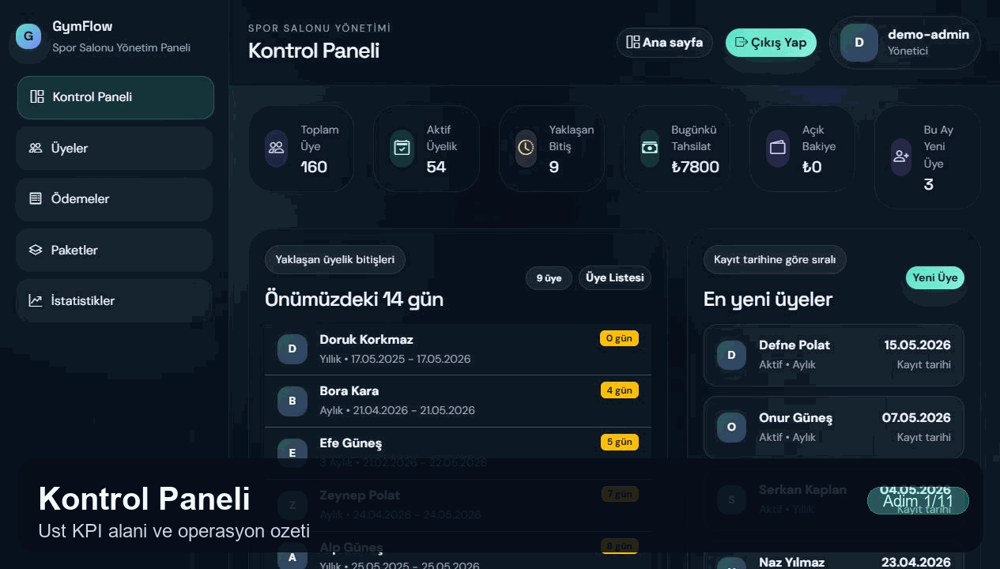
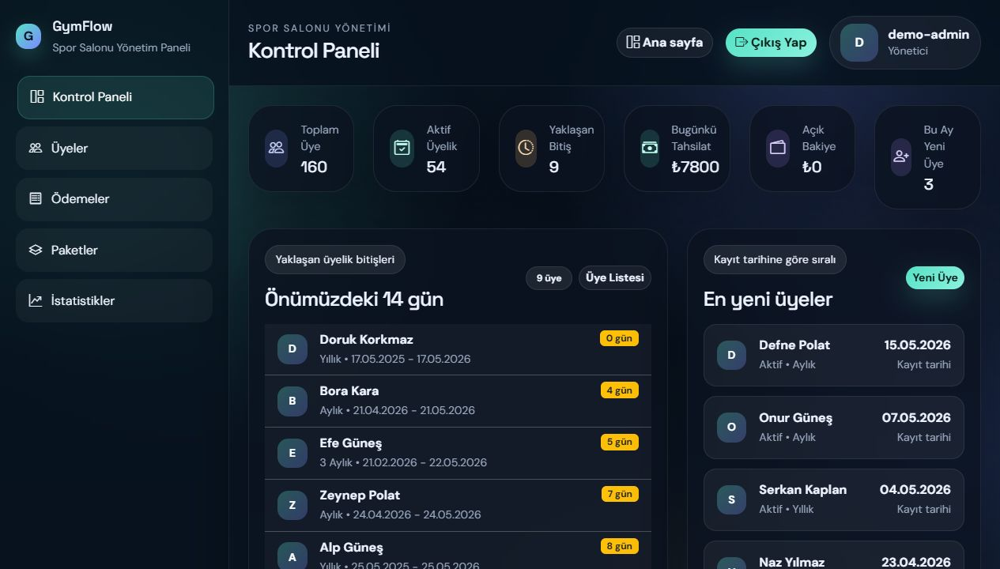
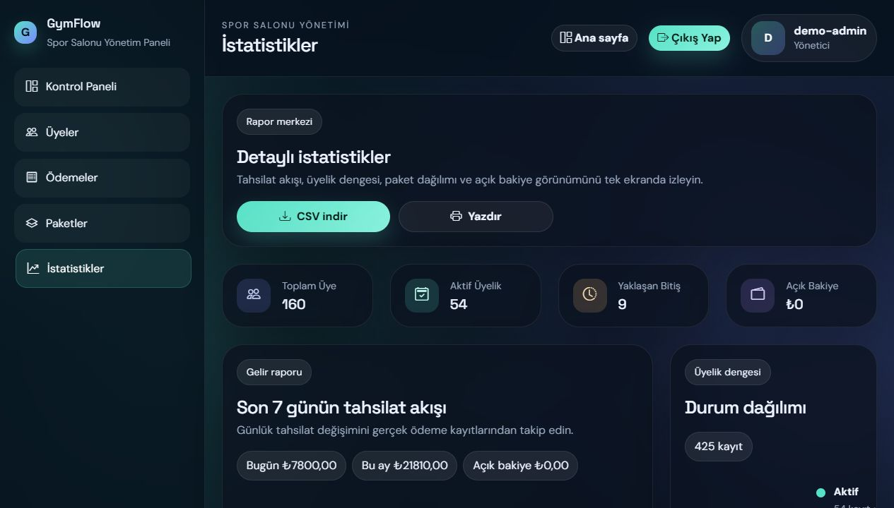
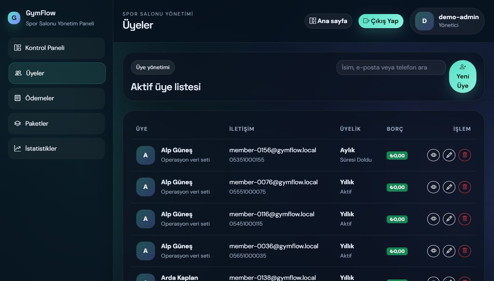
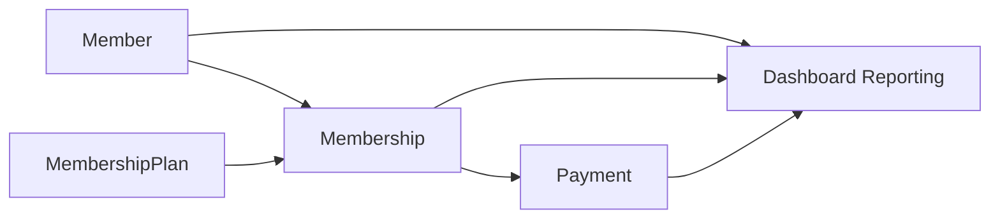

# GymFlow

<p align="center">
  Spor salonları için geliştirilen, üyelik ve tahsilat operasyonlarını tek panelde yöneten Django tabanlı yönetim uygulaması.
</p>

<p align="center">
  <a href="https://gymflow-jpmt.onrender.com">Canlı Demo</a>
  ·
  <a href="https://github.com/sametssenturk/gymflow">Kaynak Kod</a>
</p>

<p align="center">
  
  
  
  
  
</p>

## Proje Özeti

GymFlow, spor salonlarının günlük operasyonlarını sade ve hızlı bir akışla yönetebilmesi için tasarlanmış bir web uygulamasıdır. Uygulama; üye kayıtlarını, üyelik paketlerini, tahsilat akışını, yaklaşan bitişleri ve yönetim raporlarını tek bir arayüzde toplar.

Bu proje yalnızca arayüz odaklı bir demo değildir. İş kurallarını modelleyen gerçek bir yönetim paneli mantığıyla geliştirilmiştir:

- Üyelik fiyatı geçmişe dönük korunur.
- Ödemeler kalan bakiyeye göre doğrulanır.
- İptal edilen tahsilatlar ayrı durum bilgisiyle izlenir.
- Dashboard ve istatistik ekranları doğrudan ilişkisel veriden üretilir.
- Demo veri seti tek komutla yeniden oluşturulabilir.

## Canlı Demo

**Canlı adres:** [https://gymflow-jpmt.onrender.com](https://gymflow-jpmt.onrender.com)

**Demo erişimi**

- Canlı demo giriş bilgileri README içinde public olarak paylaşılmaz.
- Erişim bilgileri proje sahibi tarafından kontrollü şekilde ayrıca paylaşılır.

**Canlı demo davranışı**

- Canlı ortam tek bir paylaşımlı veritabanı üzerinde çalışır.
- Demo hesabıyla yapılan değişiklikler aynı veritabanına yazılır.
- Bu nedenle bir ziyaretçinin yaptığı değişiklikler diğer ziyaretçilere de yansıyabilir.
- Mevcut canlı yapılandırmada otomatik veri sıfırlama kapalıdır; veri, yeniden seed edilene kadar son haliyle kalır.

## Ekran Görüntüleri

### Kısa Ürün Turu



### Kontrol Paneli



### İstatistikler



### Üye Yönetimi



## Öne Çıkan Özellikler

- Yönetici girişi ve yetkili panel erişimi
- Üye oluşturma, düzenleme, silme ve detay görüntüleme
- Üye bazında üyelik geçmişi, ödeme geçmişi ve bakiye takibi
- Üyelik paketi oluşturma ve aktif/pasif paket yönetimi
- Üyelik yaşam döngüsü: planlandı, aktif, donduruldu, süresi doldu
- Üyelik dondurma akışı ve bitiş tarihinin güncellenmesi
- Nakit ve kart ödemeleri için tahsilat kaydı
- Fazla ödeme engeli ve finansal kayıt doğrulamaları
- İptal edilen ödemelerin ayrı durum ile izlenmesi
- Dashboard KPI'ları: toplam üye, aktif üyelik, yaklaşan bitiş, günlük tahsilat, açık bakiye
- Detaylı istatistik ekranı: gelir trendi, ödeme yöntemi dağılımı, paket yoğunluğu, borç görünümü
- CSV rapor çıktısı
- Giriş yapmadan görüntülenebilen read-only demo dashboard
- Ortam değişkenleriyle yönetilen production uyumlu deploy yapısı

## Mimari

GymFlow, Django'nun server-rendered yaklaşımıyla geliştirilmiştir. Kimlik doğrulama, iş kuralları, raporlama ve sunum katmanları birbirinden ayrılmıştır.

### Katmanlar

- `accounts`: giriş akışı, özel kullanıcı modeli, yönetici oturumu
- `members`: üye CRUD akışları, üye detay ekranı
- `memberships`: paket ve üyelik modelleri, üyelik yaşam döngüsü
- `payments`: tahsilat kayıtları, iptal ve doğrulama kuralları
- `dashboard`: KPI üretimi, rapor ekranları, CSV çıktısı, demo veri üretimi
- `core`: genel ana sayfa ve ortak yardımcı yapılar
- `config`: Django ayarları, URL yapısı, WSGI/ASGI girişleri

### Veri Akışı



### Proje Yapısı

```text
accounts/         Kimlik doğrulama, admin erişimi ve kullanıcı modeli
config/           Django ayarları, URL yönlendirmeleri, ASGI/WSGI girişleri
core/             Genel ana sayfa ve ortak yardımcı yapılar
dashboard/        Dashboard, istatistikler, CSV raporu, demo seed komutları
members/          Üye yönetimi ve detay ekranları
memberships/      Paket ve üyelik yönetimi
payments/         Tahsilat akışları ve finansal doğrulamalar
static/           CSS ve statik varlıklar
templates/        Django template dosyaları
docs/images/      README ekran görüntüleri
```

## Temel İş Kuralları

- `Membership.agreed_price`, paket fiyatı sonradan değişse bile eski üyelik kaydının fiyatını korur.
- Aynı üyeye eş zamanlı olarak çakışan açık üyelik açılması engellenir.
- Dondurulan üyeliklerde bitiş tarihi dondurma süresi kadar uzatılır.
- `Payment` kayıtları, bağlı üyeliğin kalan bakiyesini aşamaz.
- İptal edilen ödemeler fiziksel olarak kaybolmaz; `VOIDED` statüsüyle izlenir.
- Dashboard raporları, saklanan özetlerden değil, doğrudan operasyonel veriden hesaplanır.

## Teknoloji Yığını

- Python 3.12
- Django 5.2
- PostgreSQL
- SQLite
- Gunicorn
- WhiteNoise
- Pillow
- HTML
- CSS
- Bootstrap Icons

## Veritabanı Modeli

Uygulama dört temel model üzerine kuruludur:

- `Member`: üye profili, iletişim bilgileri, notlar, profil fotoğrafı
- `MembershipPlan`: paket adı, süresi, fiyatı ve aktiflik durumu
- `Membership`: üye-paket ilişkisi, başlangıç ve bitiş tarihi, durum, anlaşma fiyatı
- `Payment`: üye ve üyeliğe bağlı ödeme kaydı, yöntem, durum ve iptal bilgisi

Yerelde varsayılan veritabanı `SQLite` iken, production ortamında `DATABASE_URL` üzerinden `PostgreSQL` kullanılır.

## Yerel Kurulum

```powershell
python -m venv .venv
.venv\Scripts\Activate.ps1
pip install -r requirements.txt
Copy-Item .env.example .env
python manage.py migrate
python manage.py runserver
```

Yerel adresler:

- Ana sayfa: `http://127.0.0.1:8000/`
- Demo dashboard: `http://127.0.0.1:8000/demo-dashboard/`
- Yönetici girişi: `http://127.0.0.1:8000/accounts/login/`

## Demo Veri Seti

Proje, portföy gösterimi ve gerçekçi kullanım senaryosu için özel bir demo veri üretim akışı içerir. `prepare_portfolio_demo` komutu:

- demo yönetici hesabını oluşturur veya günceller,
- demo üyeleri yeniden üretir,
- üyelikleri ve ödeme geçmişini senaryolaştırır,
- istenirse tüm operasyonel veriyi temizleyip seed işlemini baştan kurar.

Örnek kullanım:

```powershell
python manage.py prepare_portfolio_demo `
  --username demo-admin `
  --password "güçlü-bir-parola" `
  --email demo@gymflow.local `
  --members 160 `
  --reset-all-data `
  --preserve-plans
```

Varsayılan kurgu, yaklaşık `160` üye ölçeğinde geniş bir operasyon veri seti üretir. Seed akışı, production benzeri ortamlarda da hızlı çalışacak şekilde optimize edilmiştir.

## Deploy Mimarisi

GymFlow'un güncel canlı kurulumu aşağıdaki yapı ile yayınlanmaktadır:

- **Uygulama katmanı:** Render Web Service
- **Veritabanı katmanı:** Neon PostgreSQL
- **Uygulama sunucusu:** Gunicorn
- **Statik dosyalar:** WhiteNoise
- **Güvenlik ve production ayarları:** environment variables üzerinden Django settings

### Production Akışı

1. GitHub repository Render'a bağlanır.
2. Render build aşamasında bağımlılıkları kurar ve `collectstatic` çalıştırır.
3. Uygulama ayağa kalkarken `migrate` çalışır.
4. Django, Neon PostgreSQL veritabanına bağlanır.
5. WhiteNoise ile statik dosyalar aynı servis üzerinden sunulur.

### Build ve Start Komutları

**Build**

```powershell
pip install -r requirements.txt && python manage.py collectstatic --noinput
```

**Start**

```powershell
python manage.py migrate && gunicorn config.wsgi --bind 0.0.0.0:$PORT --log-file -
```

`Procfile` içinde de aynı uygulama başlangıç komutu tanımlıdır.

## Ortam Değişkenleri

Temel production değişkenleri:

| Değişken | Açıklama |
| --- | --- |
| `SECRET_KEY` | Django uygulama gizli anahtarı |
| `DEBUG` | Production ortamında `0` olmalıdır |
| `ALLOWED_HOSTS` | İzin verilen host listesi |
| `CSRF_TRUSTED_ORIGINS` | HTTPS origin listesi |
| `DATABASE_URL` | PostgreSQL veya SQLite bağlantı adresi |
| `DB_SSLMODE` | PostgreSQL SSL modu |
| `USE_X_FORWARDED_PROTO` | Proxy arkasında HTTPS bilgisini kullanır |
| `USE_X_FORWARDED_HOST` | Gerçek host bilgisini üst katmandan alır |
| `SECURE_SSL_REDIRECT` | HTTP isteklerini HTTPS'e yönlendirir |
| `SESSION_COOKIE_SECURE` | Oturum çerezlerini secure modda tutar |
| `CSRF_COOKIE_SECURE` | CSRF çerezlerini secure modda tutar |
| `ALLOW_SQLITE_IN_PRODUCTION` | Production'da SQLite kullanımını kontrol eder |
| `PORTFOLIO_DEMO_USERNAME` | Demo yönetici kullanıcı adı |
| `PORTFOLIO_DEMO_PASSWORD` | Demo yönetici parolası |
| `PORTFOLIO_DEMO_EMAIL` | Demo yönetici e-postası |
| `PORTFOLIO_DEMO_MEMBER_COUNT` | Üretilecek demo üye sayısı |
| `PORTFOLIO_DEMO_RESET_ON_LOGIN` | Girişte otomatik reseed davranışı |
| `PORTFOLIO_DEMO_RESET_ALL_DATA` | Seed öncesi operasyon verisini temizler |
| `PORTFOLIO_DEMO_PRESERVE_PLANS` | Paket kataloğunu koruyarak seed çalıştırır |

Yerel örnek ortam dosyası için `.env.example` kullanılabilir.

## Kalite Kontrolleri

```powershell
python manage.py check
python manage.py test
```

Production benzeri doğrulama:

```powershell
$env:DEBUG='0'
$env:SECRET_KEY='uzun-rastgele-bir-secret-key'
$env:ALLOW_SQLITE_IN_PRODUCTION='1'
$env:ALLOWED_HOSTS='127.0.0.1,localhost'
python manage.py check --deploy
```

Güncel durumda proje test paketi `63` test ile başarıyla doğrulanmıştır.

## Git'e Dahil Edilmeyen Dosyalar

Repository dışında tutulan tipik dosyalar:

- `.env`
- `db.sqlite3`
- `media/`
- `staticfiles/`
- `*.log`
- `__pycache__/`
- `.venv/`
- `venv/`

## Son Durum

Bu repository'nin güncel hali:

- canlı deploy edilmiş,
- Neon PostgreSQL ile production veritabanına bağlanmış,
- paylaşımlı demo hesabı ile erişilebilir,
- seed akışı optimize edilmiş,
- testleri geçmiş,
- portföy sunumuna uygun ekran görüntüleriyle belgelenmiş durumdadır.
